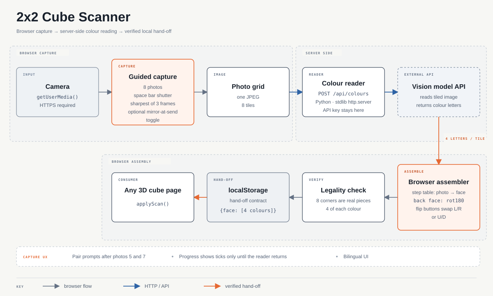

# 2x2 Cube Scanner

Point a laptop camera at a real 2x2 cube, take eight photos with the space bar, and get the cube
on screen. Built for a young learner: no colour names to type, no calibration, bilingual (English / 中文).



## How it works

1. **Guided capture.** The page tells you which face to show and how to turn the cube between
   photos (four spins, then three rolls). Space bar is the shutter; it keeps the sharpest of three
   frames. Photos 5 and 7 are re-sightings of earlier faces and are checked against them.
2. **One grid, one call.** The eight photos are laid out as a single JPEG grid and posted to
   `/api/colours`. Nine separate images cost ~10k prompt tokens and 4 s; the grid costs ~1.4k and
   under 2 s with the same reading.
3. **The model only reads colours.** `server/colour_reader.py` asks a vision model for the four
   sticker colours of each tile, top-left, top-right, bottom-left, bottom-right. It is never asked
   which face a photo is or how the cube was turned. Thinking is switched off: it is perception,
   not deliberation, and it was measured to make the answer worse.
4. **The browser does the geometry.** A step table maps each photo to a face (the back face is
   stored rotated 180 degrees), and the assembled cube is checked: four stickers of each colour and
   eight corners that are real pieces. Two flip buttons swap L/R or U/D if a turn went the wrong way.
5. **Hand-off.** The result is saved to `localStorage` as `cube-scan-cube` = `{"F": ["R","R","R","R"], ...}`
   using face letters `U D F B R L` for colours, and the cube page picks it up (see `integration/`).

Mirror handling is one checkbox under *Advanced*: "The camera defaults to mirror". When ticked, each
photo is mirrored as it is sent to the reader. Nothing else in the chain mirrors anything.

## Run it

```bash
# 1. the colour reader (Python 3.9+, stdlib only)
GEMINI_API_KEY=your-key python3 server/colour_reader.py        # 127.0.0.1:8901
# 2. serve scan.html over https (cameras need a secure origin) and proxy /api/colours to :8901
```

Any static server plus a reverse proxy works. `localhost` counts as a secure origin for testing.

## Integration

`integration/scan-integration.js` is the block a 3D cube page uses to consume the hand-off: it maps
faces to sticker positions, rebuilds the cube, and adds a "Scan my cube" button. Adapt `SCAN_SLOTS`
to your own cube model.

## Colour scheme

The renderer assumes a standard shop cube: white up, yellow down, red front, orange back, blue right,
green left. `TO_RENDERER` in `scan.html` maps scanned colours to that scheme.

## Licence

MIT.
